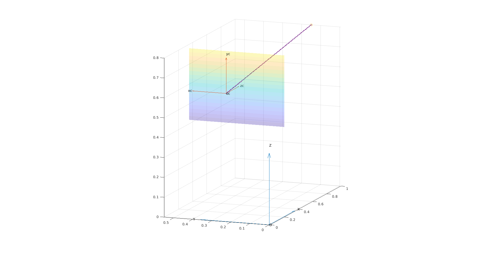

# Visual Servoing: IBVS vs PBVS

The project is a simple comparison between the classical and most famous approaches to visual servoing: Image Based and Position Based. In order to do that, a Pinhole camera model has been used.

The files are organized as follows:

- **reference_systems.m** : script that shows the reference systems *world frame* and *camera frame*;
- **camera.m** : It is the main matlab sript. It simulates the projection in the image plane of a point and a rectangle, located in front of the camera at a fixed distance and creates the relative plots;
- **proj.m** : function that executes the projection in the image plane;
- **rot.m** : function that executes the rototraslation from world frame to camera frame;
- **take_photo** : function that returns the projection in another 2D plot (like a photograph);
- the directory **IBVS** contains the Simulink model of the Image Based control
- the directory **PBVS** contains the Simulink model of the Position Based control

<h3>Pinhole camera model</h3>
To have a representation of the camera model is enough to run camera.m. Parameters that can be changed are:

- **O**, which is the position of the world frame;
- **C**, which is the position of the camera frame;
- **f**, focal distance of the camera, which is a fundamental parameter of the camera.

After the execution of the script two plots will appear: one for the projection of a generic point and one for the projection in the image plane of an inclined rectangle.

The second plot also contains the projection in a separate chart (as a photograph).

<figure class="image">
  
  <figcaption></figcaption>
</figure>

<figure class="image">  
  
  <figcaption></figcaption>
</figure>

<h3>IBVS</h3>
<figure class="image">  
  
  <figcaption></figcaption>
</figure>

<h3>PBVS</h3>
<figure class="image">  
  
  <figcaption></figcaption>
</figure>
